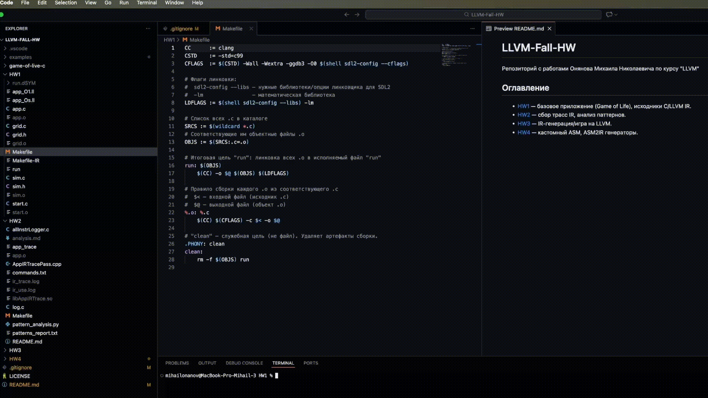

# LLVM-Fall-HW 2025
Репозиторий с работами Онянова Михаила Николаевича по курсу "LLVM"

## Оглавление
- [HW1](HW1) — базовое приложение (Game of Life), исходники C/LLVM IR.
- [HW2](HW2) — сбор трасс IR, анализ паттернов.
- [HW3](HW3) — IR-генерация/игра на LLVM.
- [HW4](HW4) — кастомный ASM, ASM2IR генераторы.

---
